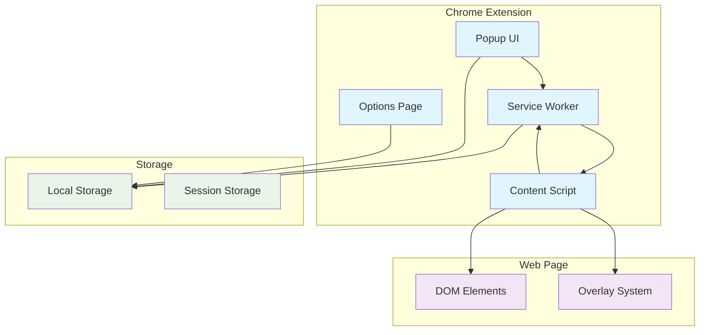

# Design Document

## Overview

LocateFlow is a Chrome Extension built using Manifest V3 that provides real-time web element inspection and locator generation capabilities. The extension follows a modular architecture with clear separation between content scripts, service workers, and popup UI components. All data processing occurs client-side to ensure user privacy, with local storage used for preferences and history management.

The extension operates in two primary modes: inspection mode for element selection and analysis mode for locator generation and confidence scoring. The architecture prioritizes performance, security, and user experience while maintaining compatibility with modern Chrome security policies.

## Architecture

### High-Level Architecture



### Component Architecture

The extension follows a layered architecture pattern:

1. **Presentation Layer**: Popup UI and Options Page
2. **Service Layer**: Service Worker for background processing
3. **Content Layer**: Content Scripts for DOM interaction
4. **Data Layer**: Chrome Storage API for persistence

## Components and Interfaces

### 1. Service Worker (background.js)

**Responsibilities:**
- Manage extension lifecycle and state
- Handle cross-tab communication
- Coordinate between popup and content scripts
- Manage storage operations
- Handle extension icon and badge updates

**Key Interfaces:**
```typescript
interface ServiceWorkerAPI {
  activateInspection(tabId: number): Promise<void>
  deactivateInspection(tabId: number): Promise<void>
  saveLocatorToHistory(locator: LocatorData): Promise<void>
  getLocatorHistory(): Promise<LocatorData[]>
  updateUserPreferences(preferences: UserPreferences): Promise<void>
}
```

### 2. Content Script (content.js)

**Responsibilities:**
- DOM element inspection and highlighting
- Element selection and data extraction
- Locator generation and confidence scoring
- Overlay management and visual feedback
- Screenshot capture functionality

**Key Interfaces:**
```typescript
interface ContentScriptAPI {
  enableInspectionMode(): void
  disableInspectionMode(): void
  highlightElement(element: HTMLElement): void
  selectElement(element: HTMLElement): LocatorResult
  generateLocators(element: HTMLElement): LocatorStrategy[]
  captureElementScreenshot(element: HTMLElement): Promise<string>
}
```

### 3. Popup UI (popup.html/popup.js)

**Responsibilities:**
- Display extension controls and status
- Show generated locators with copy functionality
- Display recent locators history
- Provide access to settings and preferences
- Theme management and UI state

**Key Interfaces:**
```typescript
interface PopupAPI {
  toggleInspectionMode(): Promise<void>
  displayLocators(locators: LocatorStrategy[]): void
  showHistory(history: LocatorData[]): void
  copyToClipboard(text: string): Promise<void>
  updateTheme(theme: 'light' | 'dark' | 'auto'): void
}
```

### 4. Locator Engine (locator-engine.js)

**Responsibilities:**
- Generate multiple locator strategies
- Calculate confidence scores
- Validate locator uniqueness and stability
- Handle ARIA accessibility attributes

**Key Interfaces:**
```typescript
interface LocatorEngine {
  generateAllStrategies(element: HTMLElement): LocatorStrategy[]
  calculateConfidence(locator: string, element: HTMLElement): ConfidenceScore
  validateLocator(locator: string, expectedElement: HTMLElement): boolean
  getAccessibilityLocators(element: HTMLElement): LocatorStrategy[]
}
```

### 5. Storage Manager (storage.js)

**Responsibilities:**
- Manage user preferences persistence
- Handle locator history storage and retrieval
- Implement storage quotas and cleanup
- Provide data migration capabilities

**Key Interfaces:**
```typescript
interface StorageManager {
  savePreferences(preferences: UserPreferences): Promise<void>
  loadPreferences(): Promise<UserPreferences>
  addToHistory(locator: LocatorData): Promise<void>
  getHistory(limit?: number): Promise<LocatorData[]>
  clearHistory(): Promise<void>
}
```

## Data Models

### Core Data Types

```typescript
interface LocatorStrategy {
  type: 'css' | 'xpath' | 'id' | 'class' | 'name' | 'tag' | 'aria'
  selector: string
  confidence: ConfidenceScore
  explanation: string
  isUnique: boolean
  isStable: boolean
}

interface ConfidenceScore {
  score: number // 0-100
  factors: ConfidenceFactor[]
  warnings: string[]
}

interface ConfidenceFactor {
  factor: string
  impact: 'positive' | 'negative'
  weight: number
  description: string
}

interface LocatorData {
  id: string
  timestamp: number
  url: string
  elementInfo: ElementInfo
  strategies: LocatorStrategy[]
  screenshot?: string
}

interface ElementInfo {
  tagName: string
  textContent: string
  attributes: Record<string, string>
  position: DOMRect
  xpath: string
}

interface UserPreferences {
  theme: 'light' | 'dark' | 'auto'
  defaultLocatorTypes: LocatorType[]
  historyLimit: number
  showConfidenceExplanations: boolean
  enableScreenshots: boolean
  highlightColor: string
}
```

### Storage Schema

```typescript
interface ExtensionStorage {
  preferences: UserPreferences
  history: LocatorData[]
  activeTab?: number
  inspectionMode: boolean
}
```

## Error Handling

### Error Categories and Strategies

1. **DOM Access Errors**
   - Graceful degradation when elements are not accessible
   - Retry mechanisms for dynamic content
   - Clear user feedback for permission issues

2. **Storage Errors**
   - Fallback to session storage when local storage fails
   - Data validation and corruption recovery
   - Storage quota management

3. **Content Script Injection Errors**
   - Retry injection with exponential backoff
   - Fallback to basic functionality when injection fails
   - User notification for unsupported pages

4. **Locator Generation Errors**
   - Fallback to simpler locator strategies
   - Error logging with context information
   - User-friendly error messages

### Error Handling Implementation

```typescript
interface ErrorHandler {
  handleDOMError(error: Error, context: string): void
  handleStorageError(error: Error, operation: string): void
  handleInjectionError(error: Error, tabId: number): void
  logError(error: Error, context: ErrorContext): void
}

interface ErrorContext {
  component: string
  operation: string
  tabId?: number
  url?: string
  timestamp: number
}
```

## Testing Strategy

### Test-Driven Development (TDD) Integration

The entire development process will follow strict TDD methodology with Red-Green-Refactor cycles:

1. **TDD Workflow Integration**
   - Every feature implementation begins with failing tests
   - No production code written without corresponding failing test
   - Continuous refactoring while maintaining green tests
   - Test-first approach for all components and integrations

2. **TDD-Specific Design Considerations**
   - All components designed with dependency injection for testability
   - Clear interfaces and abstractions to enable mocking
   - Separation of concerns to allow isolated unit testing
   - Event-driven architecture to facilitate test-driven development

### Unit Testing Approach (TDD-First)

1. **Locator Engine Testing**
   - Write failing tests for each locator strategy before implementation
   - Test-drive confidence scoring algorithm development
   - Red-Green-Refactor for edge cases and malformed DOM structures
   - Mock DOM elements for isolated TDD cycles

2. **Storage Manager Testing**
   - Test-drive CRUD operations for preferences and history
   - TDD approach for data serialization and deserialization
   - Red-Green-Refactor for storage quota handling and cleanup
   - Mock Chrome storage API for TDD isolation

3. **Content Script Testing**
   - Test-first element highlighting and selection functionality
   - TDD for DOM event handling implementation
   - Red-Green-Refactor for screenshot capture functionality
   - Mock browser APIs and DOM methods for TDD cycles

### Integration Testing Strategy

1. **Cross-Component Communication**
   - Test message passing between service worker and content scripts
   - Validate popup to service worker communication
   - Test storage synchronization across components

2. **Browser API Integration**
   - Test Chrome extension APIs (tabs, storage, scripting)
   - Validate Manifest V3 service worker behavior
   - Test content security policy compliance

3. **End-to-End User Flows**
   - Test complete inspection workflow
   - Validate locator generation and copying
   - Test history management and preferences

### Test Data and Mocking Strategy

```typescript
interface TestHelpers {
  createMockElement(attributes: Record<string, string>): HTMLElement
  createMockDOM(structure: DOMStructure): Document
  mockChromeAPI(api: string, methods: Record<string, Function>): void
  generateTestLocators(count: number): LocatorData[]
}
```

### Testing Tools and Framework

- **Jest** for unit testing with DOM environment
- **Chrome Extension Testing Library** for extension-specific testing
- **Puppeteer** for end-to-end testing in actual Chrome environment
- **Mock Service Worker** for API mocking
- **Coverage.js** for code coverage reporting

### TDD Quality Gates and Coverage Requirements

- Minimum 90% line coverage achieved through TDD cycles
- 100% coverage for locator generation algorithms via test-first development
- 85% branch coverage for error handling paths through TDD
- All public methods must have failing tests before implementation
- Integration tests developed using TDD approach for user-facing features

### TDD-Driven Development Workflow

1. **Pre-commit TDD Validation**
   - Verify all production code has corresponding tests
   - Ensure tests were written before production code (git history validation)
   - Run full test suite to maintain green state
   - Validate TypeScript compilation and linting

2. **TDD CI/CD Pipeline**
   - Enforce test-first development through automated checks
   - Run TDD compliance validation (no production code without tests)
   - Generate coverage reports with TDD cycle tracking
   - Validate extension packaging with test-driven approach

3. **TDD Development Cycle Enforcement**
   - Each feature branch must demonstrate Red-Green-Refactor cycles
   - Code reviews must verify TDD methodology compliance
   - Refactoring sessions scheduled regularly while maintaining green tests
   - Architecture decisions recorded with TDD impact analysis